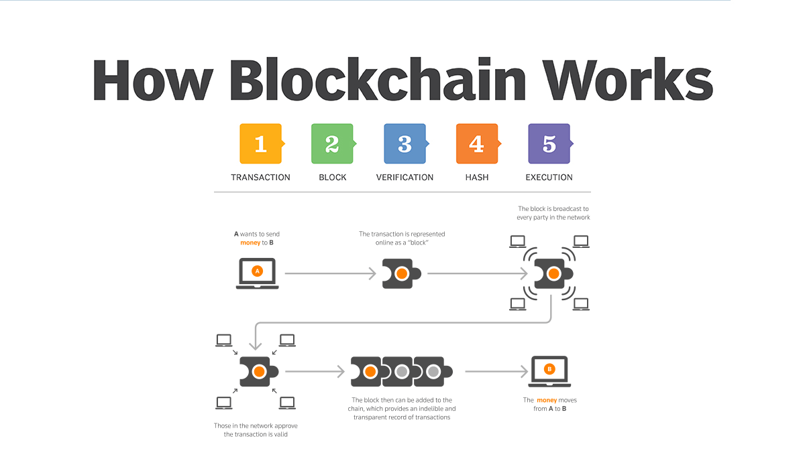

# Historical Data


**Historical price trends can indicate the future direction of a cryptocurrency**


Our decentralized exchange (DEX) APIs allow you to retrieve historical data from the point of inception of on the blockchain.

This section of our documentation will cover how our DEX historical data works, provide an example API request, and show the response objects. If you want to save large amounts of historical data, please [contact us here](https://abyiss.com/contact).

<figure><figcaption><p>How Blockchains Work</p></figcaption></figure>

## How It Works

To retrieve historical data from our DEX APIs, you can include a **`block`** number in your REST API request.&#x20;

The response will then return data from that block number and time. This allows you to get a snapshot of the market at a specific point in time.


**NOTE: Each blockchain has different block numbers**


| Parameter   | Data Type | Description                                                   |
| ----------- | --------- | ------------------------------------------------------------- |
| **`block`** | BigInt    | Blockchain block number from which you wish to retrieve data. |

## Historical Data

<mark style="color:blue;">`GET`</mark> `https://api.abyiss.com/v2/dex/{exchange}/{blockchain}/token/{token}?block={block}`

Returns an object with historical token data from the decentralized exchange.

#### Path Parameters

| Name                                         | Type   | Description                           |
| -------------------------------------------- | ------ | ------------------------------------- |
| exchange<mark style="color:red;">\*</mark>   | string | Decentralized exchange Id             |
| blockchain<mark style="color:red;">\*</mark> | string | Blockchain for Decentralized exchange |
| token                                        | string | Token contract address                |

#### Query Parameters

| Name                                     | Type   | Description                                                   |
| ---------------------------------------- | ------ | ------------------------------------------------------------- |
| apiKey<mark style="color:red;">\*</mark> | string | Your Abyiss API Key                                           |
| block<mark style="color:red;">\*</mark>  | bigInt | Blockchain block number from which you wish to retrieve data. |



```json
{
    "id": "0xc02aaa39b223fe8d0a0e5c4f27ead9083c756cc2",
    "name": "Wrapped Ether",
    "symbol": "WETH",
    "tokenDecimals": "18",
    "totalSupply": "19848",
    "tokenTotalValueLocked": "496263.702184064205187781",
    "tokenTotalValueLockedUSD": "1283992246.955587601543407324458405",
    "tokenVolume": "121792908.279612731691113232",
    "tokenVolumeUSD": "385281251499.8191539565651064429059",
    "tokenUntrackedVolumeUSD": "417601628067668.5117154048596359694",
    "tokenTxCount": "10537135",
    "tokenDerivedETH": "1",
    "tokenFeesUSD": "747842505.4534584099838376521080428"
}
```



```json
{
    "Unauthorized": "Invaild API Key"
}
```



## Example API Requests

### Historical Token Data

To retrieve historical token data from Uniswap on the Ethereum blockchain for the block number **`14369620`**, you can use the following REST API request:

**Example URL:** [https://api.abyiss.com/v2/dex/uniswap/ethereum/token/0xc02aaa39b223fe8d0a0e5c4f27ead9083c756cc2?block=14369620\&apiKey=](https://api.abyiss.com/v2/dex/uniswap/ethereum/token/0xc02aaa39b223fe8d0a0e5c4f27ead9083c756cc2?block=14369620\&apiKey=)

```json
{
    "id": "0xc02aaa39b223fe8d0a0e5c4f27ead9083c756cc2",
    "name": "Wrapped Ether",
    "symbol": "WETH",
    "tokenDecimals": "18",
    "totalSupply": "19848",
    "tokenTotalValueLocked": "496263.702184064205187781",
    "tokenTotalValueLockedUSD": "1283992246.955587601543407324458405",
    "tokenVolume": "121792908.279612731691113232",
    "tokenVolumeUSD": "385281251499.8191539565651064429059",
    "tokenUntrackedVolumeUSD": "417601628067668.5117154048596359694",
    "tokenTxCount": "10537135",
    "tokenDerivedETH": "1",
    "tokenFeesUSD": "747842505.4534584099838376521080428"
}
```

### Historical Liquidity Pool Data

To retrieve historical liquidity pool data from Uniswap on the Polygon blockchain for the block number **`23757546`**, you can use the following REST API request:

**Example URL:** [https://api.abyiss.com/v2/dex/uniswap/polygon/liquidityPool/0x45dda9cb7c25131df268515131f647d726f50608?block=23757546\&apiKey=](https://api.abyiss.com/v2/dex/uniswap/polygon/liquidityPool/0x45dda9cb7c25131df268515131f647d726f50608?block=23757546\&apiKey=)

```json
{
    "id": "0x45dda9cb7c25131df268515131f647d726f50608",
    "createdAtBlockNumber": "22765962",
    "createdAtTimestamp": "1640039738",
    "feeGrowthGlobal0X128": "60536654720404509971611872510153",
    "feeGrowthGlobal1X128": "17843914817980276280001540527907746629703",
    "feeTier": "500",
    "feesUSD": "268609.5795198478368660011539635115",
    "liquidity": "1360100430820545186",
    "liquidityProviderCount": "0",
    "observationIndex": "0",
    "sqrtPrice": "1369994126740344068227602891313558",
    "tick": "195169",
    "token0Price": "3344.427277021344663566865574862442",
    "token1Price": "0.0002990048570859140980270872373141435",
    "totalValueLockedToken0": "3619240.485924",
    "totalValueLockedETH": "2532.243503353830643465093065612289",
    "totalValueLockedToken1": "1452.565056160951251",
    "totalValueLockedUSD": "8488451.567579511717748777037757474",
    "totalValueLockedUSDUntracked": "0",
    "txCount": "192809",
    "volumeUSD": "537219159.0396956737320023079270381",
    "volumeToken1": "153656.47783655488677983",
    "volumeToken0": "537213228.54428",
    "untrackedVolumeUSD": "537219159.0396956737320023079270381",
    "token0": {
        "id": "0x2791bca1f2de4661ed88a30c99a7a9449aa84174",
        "name": "USD Coin (PoS)",
        "symbol": "USDC",
        "tokenDecimals": "6",
        "totalSupply": "16856",
        "tokenTotalValueLocked": "11437616.202225",
        "tokenTotalValueLockedUSD": "11437616.202225",
        "tokenVolume": "783379794.265346",
        "tokenVolumeUSD": "783392806.2960774506181873165042592",
        "tokenUntrackedVolumeUSD": "783157256.7401425175445112722903314",
        "tokenTxCount": "566461",
        "tokenDerivedETH": "0.0002983163045926292259138186726124447",
        "tokenFeesUSD": "584426.959863467975264105353166601"
        },
    "token1": {
        "id": "0x7ceb23fd6bc0add59e62ac25578270cff1b9f619",
        "name": "Wrapped Ether",
        "symbol": "WETH",
        "tokenDecimals": "18",
        "totalSupply": "17392",
        "tokenTotalValueLocked": "5908.192781601604246418",
        "tokenTotalValueLockedUSD": "19805128.61899933636820871402007395",
        "tokenVolume": "273735.608749455327351096",
        "tokenVolumeUSD": "960317963.5060527982632484865360554",
        "tokenUntrackedVolumeUSD": "960264229.7950206419447721856414932",
        "tokenTxCount": "517866",
        "tokenDerivedETH": "1",
        "tokenFeesUSD": "894601.2212662749769940363441506731"
    }
}
```
