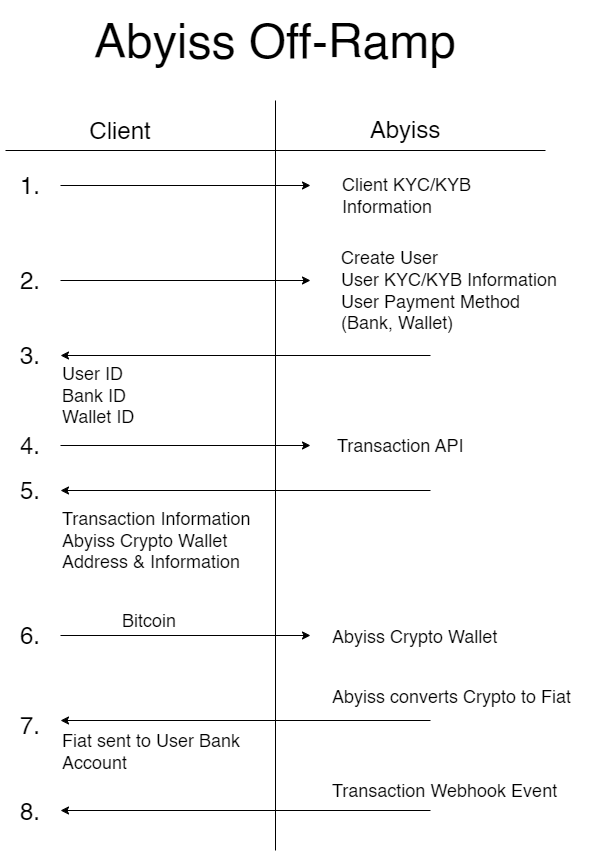

# Crypto Off Ramp APIs - Business Guide

This guide is crafted for organizations seeking a seamless off-ramp experience for customers who have completed the Know Your Customer (KYC) or Know Your Business (KYB) processes.&#x20;

It empowers organizations to create subaccounts effortlessly, enabling transaction initiation on behalf of customers with known KYC and payment information, including bank accounts and wallets.

## **Steps to Get Started:**

1. **Create an Abyiss Account:**
   * Visit [abyiss.com/signin](https://abyiss.com/signin) to create an Abyiss account for your organization.
2. **Get Your API Key:**
   * Go to [abyiss.com/home/settings](https://abyiss.com/home/settings) and obtain your API key.
3. **Complete KYB Information:**
   * Fill out the Know Your Business (KYB) information for your company at [abyiss.com/home/settings](https://abyiss.com/home/settings). This process typically takes a maximum of 1 day.
4. **Use Subaccount API:**
   * To create accounts for your customers both businesses and retail users you must utilize the [Subaccount API](../apis/subaccounts.md).
   * Subaccounts:
     * A means of creating and controlling user accounts via a master account.
     * Can be interacted with via the master account's API key.
     * Think of this as another part of the apiKey.
     * Master account can interact with subAccount payment methods and transactions.
     * Master account cannot interact with subaccounts of a subaccount.
     * A subaccount can only have one master account.
5. **KYC/KYB API:**
   * Utilize our KYC/KYB API to upload customer information. KYC/KYB approval is crucial for subaccount transaction initiation.
6. **Upload Payment Information:**
   * For payment information, use our [Bank Accounts Payment Methods API](../apis/payment-methods/bank-accounts.md) and [Wallets Payment API](../apis/payment-methods/wallets.md).
7. **Initiate Transactions:**
   * Once the subaccount has completed KYC/KYB and uploaded sufficient payment methods, initiate transactions using our [Transactions API](../apis/transactions.md).
8. **Integrate Webhooks:**
   * Enhance your integration by listening for transactions and account updates with Abyiss Webhooks.

Embark on a seamless journey with Abyiss Cryptocurrency Off Ramp APIs, unlocking the potential for efficient and secure transaction management for your organization.

## Abyiss Crypto Off-Ramp Diagram

<figure><figcaption>
Abyiss Crypto Off Ramp API Diagram Example
</figcaption></figure>
